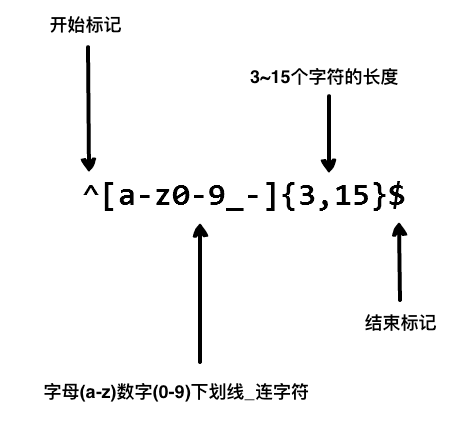

# 正则表达式 - 简介

正则表达式的使用，可以通过简单的办法来实现强大的功能。下面先给出一个简单的示例：

### ^[0-9]+abc$

* `^`为匹配输入字符串的开始位置。
* `[0-9]+`匹配多个数字， `[0-9]` 匹配**单个数字**，`+` 匹配**一个或者多个。**
* `abc$`匹配字母 abc 并以 abc 结尾，`$` 为匹配输入字符串的结束位置。


我们在写用户注册表单时，只允许用户名包含字符、数字、下划线和连接字符(-)，并设置用户名的长度，我们就可以使用以下正则表达式来设定。

以上的正则表达式可以匹配 runoob、runoob1、run-oob、run_oob， 但不匹配 ru，因为它包含的字母太短了，小于 3 个无法匹配。也不匹配 runoob$, 因为它包含特殊字符。

### 实例

匹配以数字开头，并以 abc 结尾的字符串。：
```js
var str = "123abc";
var patt1 = /^[0-9]+abc$/;
document.write(str.match(patt1)); // 123abc
```

## 为什么使用正则表达式？

典型的搜索和替换操作要求您提供与预期的搜索结果匹配的确切文本。虽然这种技术对于对静态文本执行简单搜索和替换任务可能已经足够了，但它缺乏灵活性，若采用这种方法搜索动态文本，即使不是不可能，至少也会变得很困难。

通过使用正则表达式，可以：

* 测试字符串内的模式。例如，可以测试输入字符串，以查看字符串内是否出现电话号码模式或信用卡号码模式。这称为数据验证。
* 替换文本。可以使用正则表达式来识别文档中的特定文本，完全删除该文本或者用其他文本替换它。
* 基于模式匹配从字符串中提取子字符串。
* 可以查找文档内或输入域内特定的文本。

### 发展历史

正则表达式的"祖先"可以一直上溯至对人类神经系统如何工作的早期研究。Warren McCulloch 和 Walter Pitts 这两位神经生理学家研究出一种数学方式来描述这些神经网络。

1956 年, 一位叫 Stephen Kleene 的数学家在 McCulloch 和 Pitts 早期工作的基础上，发表了一篇标题为"神经网事件的表示法"的论文，引入了正则表达式的概念。正则表达式就是用来描述他称为"正则集的代数"的表达式，因此采用"正则表达式"这个术语。

随后，发现可以将这一工作应用于使用 Ken Thompson 的计算搜索算法的一些早期研究，Ken Thompson 是 Unix 的主要发明人。正则表达式的第一个实用应用程序就是 Unix 中的 qed 编辑器。

如他们所说，剩下的就是众所周知的历史了。从那时起直至现在正则表达式都是基于文本的编辑器和搜索工具中的一个重要部分。

应用领域
目前，正则表达式已经在很多软件中得到广泛的应用，包括 *nix（Linux, Unix等）、HP 等操作系统，PHP、C#、Java 等开发环境，以及很多的应用软件中，都可以看到正则表达式的影子。

